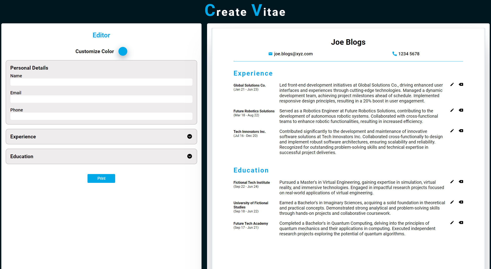

# Create Vitae 📄

Welcome to Create Vitae, your go-to CV creation application! Craft stunning and professional resumes with ease using this React-powered tool. Create Vitae provides an intuitive interface for building your curriculum vitae while incorporating some clever wordplay (pun intended!).




## Technologies Used

- **React**: A powerful JavaScript library for building user interfaces.
- **JavaScript**: The language that brings interactivity to the application.
- **CSS**: Styles to enhance the visual appeal of your CV.

## How to Use

1. **Clone the Repository:**
   ```bash
   git clone https://github.com/your-username/create-vitae.git
   cd create-vitae

## Learning Highlights

Developing Create Vitae has been an educational journey, providing insights into several key aspects of web development:

- **React Proficiency:** The project deepened my understanding of React, refining my ability to build dynamic user interfaces. Effectively managing the application's state has been a key focus.

- **State Management:** Creating features for Create Vitae required thoughtful state management. This project enhanced my skills in designing and implementing stateful applications for a smoother user experience.

- **Library Integration:** Integrating the `react-to-print` library for printing and PDF generation expanded my toolkit. Learning to incorporate external libraries has proven valuable for enhancing application functionality.

- **User-Centric Design:** Crafting an intuitive CV creation process underscored the importance of user-centric design. Iterative improvements based on user feedback refined my approach to creating applications prioritizing a positive user experience.

- **Project Organization:** The project's folder structure and organization played a crucial role in maintaining a clean and scalable codebase. This experience emphasized the importance of thoughtful project structuring for maintainability.

This project provided practical insights, improving not only technical skills but also contributing to a broader understanding of user experience, project management, and application scalability.

